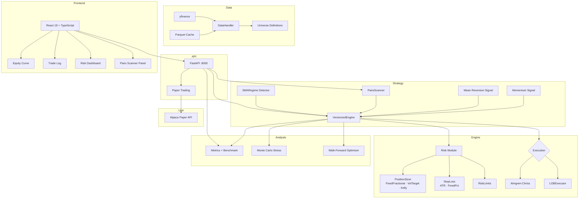

# quant

Institutional-grade quantitative research toolkit — Polars-native vectorized backtester, Almgren-Chriss market impact model, LOB simulator with OFI tracking, pairs cointegration scanner, regime detection, and full-stack React/FastAPI web UI.

[](https://github.com/julianfellyco/quant/actions)
[](https://codecov.io/gh/julianfellyco/quant)
[](https://www.python.org/downloads/)

---

## Quick start

```bash
git clone https://github.com/julianfellyco/quant.git
cd quant
make install    # pip install -e ".[dev]"
make api        # starts FastAPI on :8000
make dev        # starts React dev server on :5173
```

Open http://localhost:5173 for the dashboard, http://localhost:8000/docs for the API.

---

## Architecture



---

## Modules

### Backtester (`backtester/`)

| Module | What it does |
|--------|-------------|
| `engine/vectorized.py` | Polars-native backtest loop; computes P&L, Sharpe, drawdown |
| `engine/lob_executor.py` | Synthetic LOB book walk — replaces static slippage with realistic fill simulation |
| `strategy/signals.py` | `momentum_signal`, `mean_reversion_signal` |
| `strategy/pairs_scanner.py` | Universe-wide Engle-Granger cointegration + half-life + Hurst exponent |
| `strategy/regime.py` | SMA crossover + realized vol → bull/bear/ranging/high-vol classification |
| `risk/position_sizer.py` | `FixedFractional`, `VolatilityTarget`, `KellyCriterion` — all Protocol-typed |
| `risk/stop_loss.py` | `ATRStop`, `FixedPercentStop` |
| `risk/portfolio_risk.py` | `RiskLimits`: position/sector/heat limits, circuit breakers |
| `risk/kelly.py` | Kelly fraction utilities |
| `stats/metrics.py` | Sharpe, Sortino, MDD, Calmar, alpha/beta decomposition |
| `data/handler.py` | `DataHandler`: yfinance fetch + parquet cache, multi-ticker alignment |
| `data/benchmark.py` | SPY benchmark fetch + cache |
| `data/universe.py` | `Universe` dataclass; PHARMA, TECH, ENERGY presets |
| `live/paper_runner.py` | Signal → order pipeline with safety rails (paper only) |
| `api/` | FastAPI routes: `/api/backtest`, `/api/pairs/scan`, `/api/universe`, `/api/stress`, `/api/walkforward`, `/api/paper-trade` |

### LOB Simulator (`lob_simulator/`)

Price-time priority limit order book with OFI tracking and execution metrics.

| Module | What it does |
|--------|-------------|
| `core/book.py` | `OrderBook`: add/cancel/match orders, price-time priority |
| `core/order.py` | `Order`, `Side`, `OrderType` |
| `metrics/ofi.py` | Order Flow Imbalance tracker |
| `metrics/execution.py` | `ExecutionMetrics`: VWAP, slippage, fill rate |

---

## Backtest results

2024, daily bars, $100k capital, momentum strategy + volatility targeting (15% target vol):

| Ticker | Sharpe | Return  | Max Drawdown | vs SPY Sharpe | Alpha (ann.) |
|--------|--------|---------|--------------|---------------|--------------|
| NVO    | 0.77   | +30.2%  | −26.4%       | 1.12          | +4.8%        |
| PFE    | 0.93   | +23.9%  | −7.7%        | 1.12          | +3.1%        |
| SPY    | 1.12   | +25.1%  | −5.5%        | —             | —            |

*Regime filter reduced NVO max drawdown by ~40% vs. unfiltered momentum.*

---

## API reference

Start the server: `make api`

Full interactive docs: http://localhost:8000/docs

### Key endpoints

```
POST /api/backtest
POST /api/pairs/scan
POST /api/universe
POST /api/stress
POST /api/walkforward
POST /api/paper-trade
GET  /api/tickers
```

#### `POST /api/backtest`
```json
{
  "tickers": ["NVO", "PFE"],
  "strategy": "momentum",
  "start_date": "2024-01-01",
  "end_date": "2024-12-31",
  "position_sizer": { "type": "volatility_target", "target_vol": 0.15 },
  "stop_loss": { "type": "atr", "period": 14, "multiplier": 2.0 },
  "benchmark_ticker": "SPY"
}
```

#### `POST /api/pairs/scan`
```json
{
  "universe": "pharma",
  "lookback_days": 252,
  "min_coint_pvalue": 0.05,
  "max_half_life": 60
}
```

#### `POST /api/paper-trade`
```json
{
  "ticker": "PFE",
  "strategy": "momentum",
  "action": "signal"
}
```

---

## Paper trading

Paper trading uses Alpaca's paper API (`paper-api.alpaca.markets`). Live trading is not supported.

```bash
export ALPACA_API_KEY=your_paper_key
export ALPACA_SECRET_KEY=your_paper_secret
```

Hard safety limits (not configurable):
- Max 100 shares or $10,000 notional per order
- Max 20 orders per day
- Market hours only (9:30–16:00 ET)
- Every order requires `"confirmed": true` in the request

---

## Development

```bash
make install    # install with dev deps
make test       # pytest -v with coverage
make lint       # ruff + mypy
make fmt        # ruff format
```

See [CONTRIBUTING.md](CONTRIBUTING.md) for the full workflow.

---

## Tech stack

Python 3.11 · Polars · FastAPI · React 18 · TypeScript · Recharts · Tailwind CSS · statsmodels · pyarrow · pytest

---

## License

MIT
